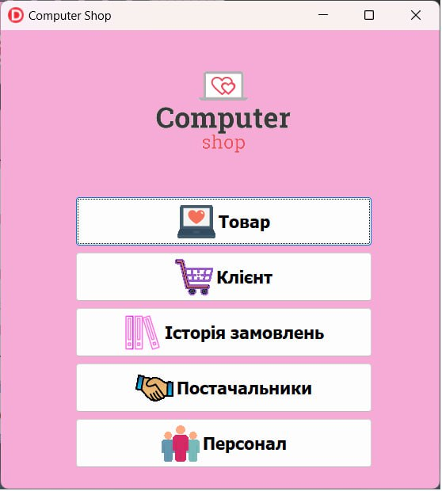
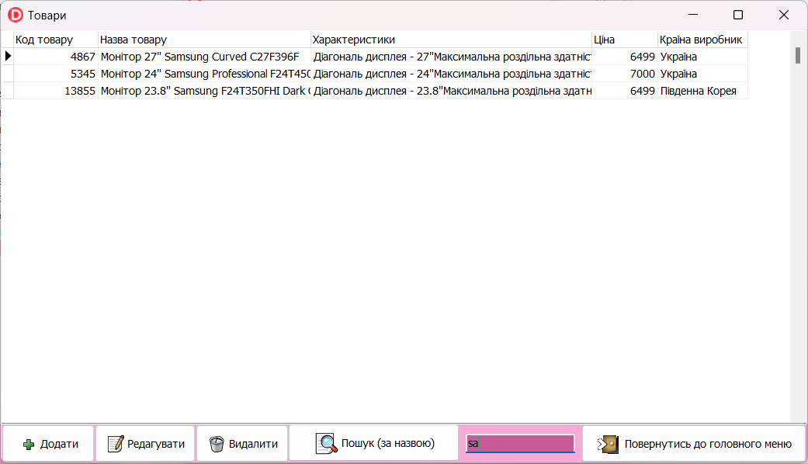
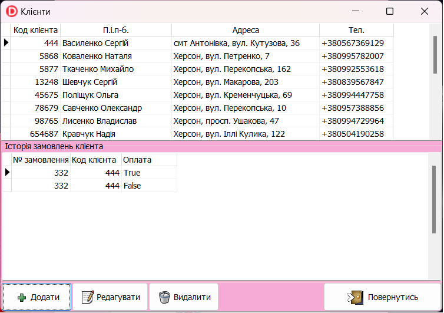
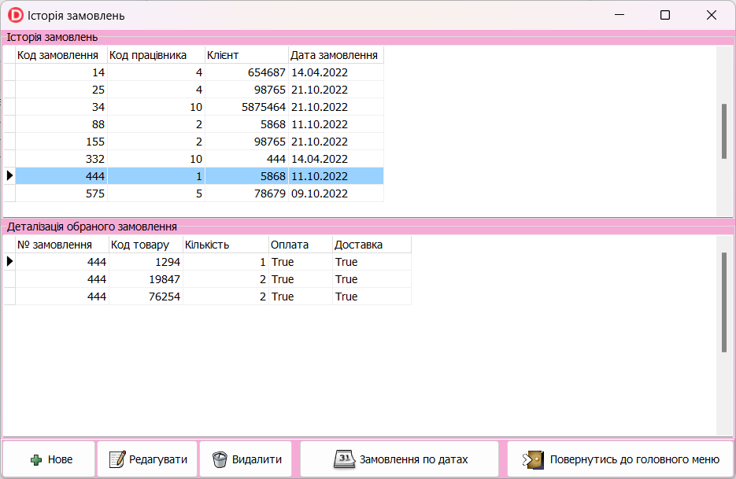
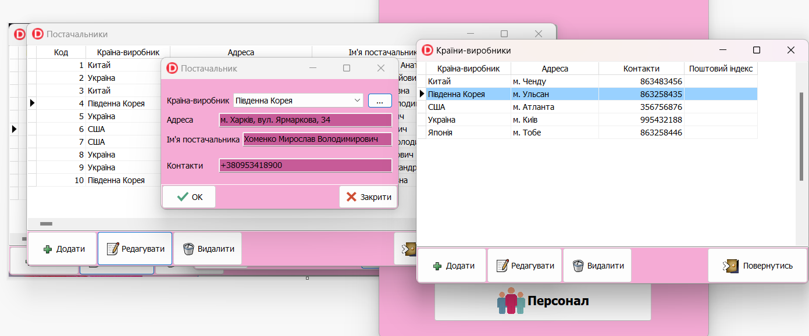

# Магазин комп'ютерної техніки - демо

Програма розроблялась як робота для курсового проекту.

В якості БД використовується файл формату Microsoft Access, середовище розробки - Delphi 11, компоненти доступу до даних - dbGO (TADOTable, TADOStoderProc).

В програмі реалізовано довідник товарів з можливісто редагування та пошуку.

Довідник клієнтів з відображенням історії замовлень кожного клієнта та можливістю редагування.

Історія замовлень з деталізацією (Master/Detail) та можливістю перегляду замовлень за вказаною датою (викликається Stored Procedure з БД). 

Довідник постачальників і довідник персоналу дозволяють зручно додавати/редагувати/видаляти відповідну інформацію. Також додатково реалізовано довідник країн-виробників, який викликається у відповідних режимах.

На розробку програми було витрачено чотири дні по кілька годин роботи щовечора.

Credits:

*  [https://www.freelogodesign.org](https://www.freelogodesign.org) - створення логотипу для програми
* [https://freeicons.io](https://freeicons.io) - піктограми для кнопок
